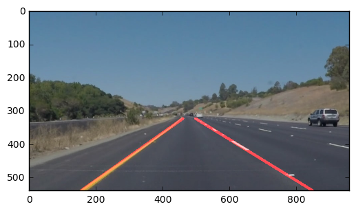

# SelfDrivCar-LaneLines-P1

In this project, tools learned are used to identify lane lines on the road . Developed your pipeline on a series of individual images, and later applied the result to a video stream. Pipeline results on the video clips are also contained in this repository.

